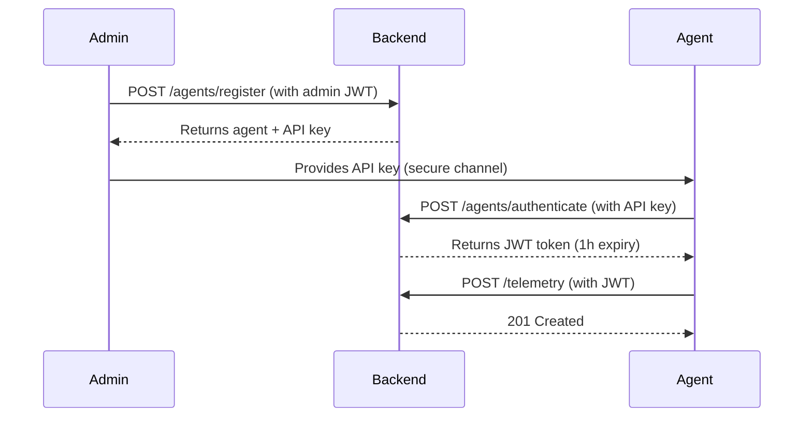

# Phase 2 API Reference

**Version:** 2.0.0  
**Date:** August 25, 2026  
**Base URL:** `http://localhost:4000/api/v1`

---

## Authentication

### Agent Authentication Flow



---

## 🔐 Agent Management APIs

### 1. Register Agent (Admin Only)

**Endpoint:** `POST /api/v1/agents/register`  
**Authentication:** User JWT (OWNER or ADMIN role)

**Request:**
```json
{
  "organizationId": "uuid",
  "name": "production-agent-1",
  "hostname": "prod-server-01",
  "platform": "linux",
  "version": "2.0.0",
  "capabilities": ["docker", "process_management", "metrics_collection"],
  "metadata": {
    "region": "us-east-1",
    "datacenter": "dc1"
  }
}
```

**Response:** `201 Created`
```json
{
  "agent": {
    "id": "agent-uuid",
    "organizationId": "org-uuid",
    "name": "production-agent-1",
    "hostname": "prod-server-01",
    "platform": "linux",
    "version": "2.0.0",
    "capabilities": ["docker", "process_management"],
    "status": "pending",
    "createdAt": "2026-08-25T10:00:00Z"
  },
  "apiKey": "BASE64URL_ENCODED_48_BYTE_KEY",
  "message": "Agent registered successfully. Store the API key securely - it cannot be retrieved later."
}
```

**⚠️ CRITICAL:** The `apiKey` is shown **only once**. Store it securely.

---

### 2. Authenticate Agent (Get JWT Token)

**Endpoint:** `POST /api/v1/agents/authenticate`  
**Authentication:** None (public endpoint)

**Request:**
```json
{
  "apiKey": "BASE64URL_ENCODED_48_BYTE_KEY"
}
```

**Response:** `200 OK`
```json
{
  "token": "JWT_TOKEN",
  "expiresIn": "1h",
  "agent": {
    "id": "agent-uuid",
    "name": "production-agent-1",
    "organizationId": "org-uuid"
  }
}
```

**Token Usage:**
```bash
curl -H "Authorization: Bearer JWT_TOKEN" \
  http://localhost:4000/api/v1/telemetry
```

---

### 3. List Agents

**Endpoint:** `GET /api/v1/agents/organizations/:organizationId`  
**Authentication:** User JWT (OWNER, ADMIN, or OPERATOR)

**Query Parameters:**
- `status` (optional): Filter by status (pending, active, inactive, revoked)
- `platform` (optional): Filter by platform

**Response:** `200 OK`
```json
{
  "agents": [
    {
      "id": "agent-uuid",
      "name": "production-agent-1",
      "hostname": "prod-server-01",
      "platform": "linux",
      "version": "2.0.0",
      "status": "active",
      "lastHeartbeat": "2026-08-25T10:15:00Z",
      "createdAt": "2026-08-25T10:00:00Z"
    }
  ],
  "total": 1
}
```

---

### 4. Get Agent Details

**Endpoint:** `GET /api/v1/agents/:id`  
**Authentication:** User JWT (OWNER, ADMIN, or OPERATOR)

**Response:** `200 OK`
```json
{
  "agent": {
    "id": "agent-uuid",
    "organizationId": "org-uuid",
    "name": "production-agent-1",
    "hostname": "prod-server-01",
    "platform": "linux",
    "version": "2.0.0",
    "capabilities": ["docker", "process_management"],
    "status": "active",
    "lastHeartbeat": "2026-08-25T10:15:00Z",
    "metadata": {
      "region": "us-east-1"
    },
    "createdAt": "2026-08-25T10:00:00Z",
    "updatedAt": "2026-08-25T10:15:00Z"
  }
}
```

---

### 5. Update Agent Status

**Endpoint:** `PATCH /api/v1/agents/:id/status`  
**Authentication:** User JWT (OWNER or ADMIN)

**Request:**
```json
{
  "status": "active"
}
```

**Valid Status Values:** `pending`, `active`, `inactive`, `revoked`

**Response:** `200 OK`
```json
{
  "agent": {
    "id": "agent-uuid",
    "status": "active",
    "updatedAt": "2026-08-25T10:16:00Z"
  },
  "message": "Agent status updated to active"
}
```

---

### 6. Revoke Agent

**Endpoint:** `POST /api/v1/agents/:id/revoke`  
**Authentication:** User JWT (OWNER or ADMIN)

**Response:** `200 OK`
```json
{
  "message": "Agent revoked successfully"
}
```

**Effect:**
- Agent status set to `revoked`
- All agent credentials revoked
- Agent cannot authenticate anymore

---

### 7. Rotate API Key

**Endpoint:** `POST /api/v1/agents/:id/rotate-key`  
**Authentication:** User JWT (OWNER or ADMIN)

**Response:** `200 OK`
```json
{
  "apiKey": "NEW_BASE64URL_ENCODED_48_BYTE_KEY",
  "message": "API key rotated successfully. Store the new key securely - it cannot be retrieved later."
}
```

**⚠️ CRITICAL:** Old key is immediately revoked. Agent must use new key.

---

### 8. Record Heartbeat

**Endpoint:** `POST /api/v1/agents/heartbeat`  
**Authentication:** Agent JWT

**Request:**
```json
{
  "status": "online",
  "cpuUsage": 45.2,
  "memoryUsage": 68.5,
  "processCount": 142,
  "metadata": {
    "uptime": 3600,
    "load": [1.5, 1.2, 1.1]
  }
}
```

**Valid Status Values:** `online`, `offline`, `degraded`

**Response:** `200 OK`
```json
{
  "message": "Heartbeat recorded",
  "timestamp": "2026-08-25T10:17:00Z"
}
```

**Frequency:** Recommended every 30 seconds

---

### 9. Get Agent Health History

**Endpoint:** `GET /api/v1/agents/:id/health`  
**Authentication:** User JWT (OWNER, ADMIN, or OPERATOR)

**Query Parameters:**
- `limit` (optional): Number of records to return (default: 100, max: 1000)

**Response:** `200 OK`
```json
{
  "agentId": "agent-uuid",
  "isOnline": true,
  "history": [
    {
      "status": "online",
      "cpuUsage": 45.2,
      "memoryUsage": 68.5,
      "processCount": 142,
      "timestamp": "2026-08-25T10:17:00Z"
    }
  ]
}
```

---

## 📊 Telemetry APIs

### 10. Ingest Single Telemetry Event

**Endpoint:** `POST /api/v1/telemetry`  
**Authentication:** Agent JWT

**Request:**
```json
{
  "eventType": "METRIC",
  "timestamp": "2026-08-25T10:17:00Z",
  "serviceId": "service-uuid",
  "data": {
    "cpu": 45.2,
    "memory": 68.5,
    "processCount": 142,
    "topProcesses": [
      {
        "name": "node",
        "pid": 1234,
        "cpu": 25.5,
        "memory": 512
      }
    ]
  }
}
```

**Response:** `201 Created`
```json
{
  "message": "Telemetry ingested",
  "timestamp": "2026-08-25T10:17:00Z"
}
```

---

### 11. Ingest Batch Telemetry Events

**Endpoint:** `POST /api/v1/telemetry/batch`  
**Authentication:** Agent JWT

**Request:**
```json
{
  "events": [
    {
      "eventType": "METRIC",
      "timestamp": "2026-08-25T10:17:00Z",
      "data": { "cpu": 45.2 }
    },
    {
      "eventType": "METRIC",
      "timestamp": "2026-08-25T10:17:30Z",
      "data": { "cpu": 46.1 }
    }
  ]
}
```

**Limits:**
- Minimum: 1 event
- Maximum: 1000 events per batch

**Response:** `201 Created`
```json
{
  "message": "Telemetry batch ingested",
  "count": 2,
  "timestamp": "2026-08-25T10:17:30Z"
}
```

---

### 12. Query Telemetry Events

**Endpoint:** `GET /api/v1/telemetry`  
**Authentication:** User JWT (OWNER, ADMIN, or OPERATOR)

**Query Parameters:**
- `organizationId` (required): Organization UUID
- `agentId` (optional): Filter by agent
- `serviceId` (optional): Filter by service
- `eventType` (optional): Filter by event type
- `startTime` (optional): ISO8601 timestamp
- `endTime` (optional): ISO8601 timestamp
- `limit` (optional): Max results (default: 1000, max: 10000)

**Example:**
```
GET /api/v1/telemetry?organizationId=org-uuid&eventType=METRIC&limit=100
```

**Response:** `200 OK`
```json
{
  "events": [
    {
      "id": "event-uuid",
      "agentId": "agent-uuid",
      "serviceId": "service-uuid",
      "eventType": "METRIC",
      "timestamp": "2026-08-25T10:17:00Z",
      "data": { "cpu": 45.2 },
      "createdAt": "2026-08-25T10:17:01Z"
    }
  ],
  "total": 1
}
```

---

### 13. Record Detection

**Endpoint:** `POST /api/v1/telemetry/detections`  
**Authentication:** Agent JWT

**Request:**
```json
{
  "detectionType": "HIGH_CPU_USAGE",
  "severity": "high",
  "confidence": 0.95,
  "message": "CPU usage exceeded 90% for 5 minutes",
  "suggestedAction": "RESTART_SERVICE",
  "serviceId": "service-uuid",
  "metadata": {
    "threshold": 90,
    "currentValue": 95.2,
    "duration": 300
  },
  "detectedAt": "2026-08-25T10:17:00Z"
}
```

**Valid Severity Values:** `critical`, `high`, `medium`, `low`, `info`

**Response:** `201 Created`
```json
{
  "detection": {
    "id": "detection-uuid",
    "detectionType": "HIGH_CPU_USAGE",
    "severity": "high",
    "confidence": 0.95,
    "message": "CPU usage exceeded 90% for 5 minutes",
    "detectedAt": "2026-08-25T10:17:00Z"
  },
  "message": "Detection recorded"
}
```

---

### 14. Get Unprocessed Detections

**Endpoint:** `GET /api/v1/telemetry/detections`  
**Authentication:** User JWT (OWNER, ADMIN, or OPERATOR)

**Query Parameters:**
- `organizationId` (required): Organization UUID
- `limit` (optional): Max results (default: 100, max: 1000)

**Response:** `200 OK`
```json
{
  "detections": [
    {
      "id": "detection-uuid",
      "agentId": "agent-uuid",
      "serviceId": "service-uuid",
      "detectionType": "HIGH_CPU_USAGE",
      "severity": "high",
      "confidence": 0.95,
      "message": "CPU usage exceeded 90%",
      "suggestedAction": "RESTART_SERVICE",
      "detectedAt": "2026-08-25T10:17:00Z",
      "createdAt": "2026-08-25T10:17:01Z"
    }
  ],
  "total": 1
}
```

---

### 15. Get Statistics

**Endpoint:** `GET /api/v1/telemetry/stats`  
**Authentication:** User JWT (OWNER, ADMIN, or OPERATOR)

**Query Parameters:**
- `organizationId` (required): Organization UUID
- `hours` (optional): Time window (default: 24, max: 168)

**Response:** `200 OK`
```json
{
  "organizationId": "org-uuid",
  "hours": 24,
  "telemetry": {
    "total": 2880,
    "byEventType": {
      "METRIC": 2400,
      "LOG": 480
    },
    "byAgent": {
      "agent-uuid-1": 1440,
      "agent-uuid-2": 1440
    }
  },
  "detections": {
    "total": 12,
    "bySeverity": {
      "critical": 2,
      "high": 5,
      "medium": 3,
      "low": 2
    },
    "byType": {
      "HIGH_CPU_USAGE": 6,
      "HIGH_MEMORY_USAGE": 4,
      "DISK_SPACE_LOW": 2
    },
    "processed": 10,
    "unprocessed": 2
  }
}
```

---

## 🔑 Authentication Examples

### Using curl with User JWT

```bash
# Login as user
TOKEN=$(curl -X POST http://localhost:4000/api/v1/auth/login \
  -H "Content-Type: application/json" \
  -d '{"email":"admin@example.com","password":"password"}' \
  | jq -r '.token')

# Register agent
curl -X POST http://localhost:4000/api/v1/agents/register \
  -H "Authorization: Bearer $TOKEN" \
  -H "Content-Type: application/json" \
  -d '{
    "organizationId": "org-uuid",
    "name": "my-agent",
    "hostname": "server-01",
    "platform": "linux",
    "version": "2.0.0"
  }'
```

### Using curl with Agent JWT

```bash
# Authenticate agent
AGENT_TOKEN=$(curl -X POST http://localhost:4000/api/v1/agents/authenticate \
  -H "Content-Type: application/json" \
  -d '{"apiKey":"YOUR_API_KEY"}' \
  | jq -r '.token')

# Send telemetry
curl -X POST http://localhost:4000/api/v1/telemetry \
  -H "Authorization: Bearer $AGENT_TOKEN" \
  -H "Content-Type: application/json" \
  -d '{
    "eventType": "METRIC",
    "data": {"cpu": 45.2, "memory": 68.5}
  }'
```

---

## 🛡️ Security Best Practices

### Agent API Keys
1. **Store securely** (environment variables, secrets management)
2. **Never commit to source control**
3. **Rotate regularly** (every 90 days recommended)
4. **Use separate keys per environment** (dev, staging, prod)
5. **Revoke immediately** if compromised

### JWT Tokens
1. **Short expiry** (1 hour for agents)
2. **Refresh before expiry** (at 50 minutes)
3. **Don't share between agents**
4. **Validate on every request**

### Organization Isolation
1. **Agents can only access their organization's data**
2. **API validates organizationId on every operation**
3. **Telemetry filtered by organization**
4. **Cross-tenant access blocked**

---

## ⚠️ Error Responses

### 400 Bad Request
```json
{
  "error": "Missing required fields"
}
```

### 401 Unauthorized
```json
{
  "error": "Invalid API key"
}
```

### 403 Forbidden
```json
{
  "error": "Agent is not active"
}
```

### 404 Not Found
```json
{
  "error": "Agent not found"
}
```

### 500 Internal Server Error
```json
{
  "error": "Failed to ingest telemetry"
}
```

---

## 📈 Rate Limits (To Be Implemented)

| Endpoint | Limit | Window |
|----------|-------|--------|
| `/agents/authenticate` | 10 requests | 1 minute |
| `/telemetry` | 1000 requests | 1 minute |
| `/telemetry/batch` | 100 requests | 1 minute |
| `/agents/heartbeat` | 120 requests | 1 minute |

---

**End of Phase 2 API Reference**
